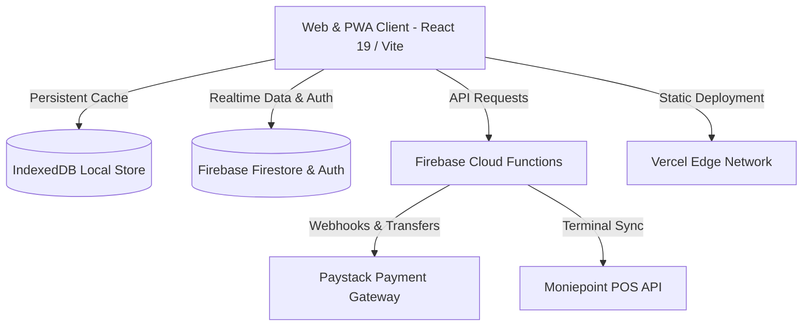

# NEXA Store OS (v2)

[](https://react.dev/)
[](https://vitejs.dev/)
[](https://tailwindcss.com/)
[](https://firebase.google.com/)
[](https://vercel.com/)

**NEXA Store OS** is an offline-first point-of-sale (POS), multi-branch inventory manager, and enterprise retail platform tailored for African retail stores, pharmacies, restaurants, supermarkets, and wholesale distributors.

---

## 🚀 Key Modules & Capabilities

### 1. Point of Sale & Checkout (Offline-First)
- **Instant Offline Checkout**: Full operation during internet outages using Firestore `persistentLocalCache` (IndexedDB) with automatic synchronization on reconnect.
- **Wholesale & Retail Dual-Pricing**: Seamless toggle between Retail, Wholesale, and Tiered customer pricing per item or entire cart.
- **Barcode & QR Scanning**: In-app camera barcode reader, USB HID barcode scanner support, and printable shelf label generator.
- **Digital & Thermal Receipts**: ESC/POS thermal printer integration, WhatsApp receipt dispatch, and PDF export.

### 2. Multi-Channel Payments & Billing
- **Dynamic One-Time Virtual Accounts**: On-demand Paystack dynamic bank transfer accounts with automatic transaction fee calculation.
- **Moniepoint Terminal Sync**: Real-time webhook listener and reconciliation for POS card swipe machines.
- **Customer Store Credits & Debtors Ledger**: Complete debt tracking, repayment history, and automated SMS/WhatsApp reminders.

### 3. Inventory & Multi-Branch Operations
- **Stock Movement Timeline**: Inter-branch stock transfers, restock orders, breakages, returns, and inventory audits.
- **Multi-Unit Conversions**: Sell products by piece, pack, carton, roll, or custom measurement units.
- **Low Stock & Expiry Alerts**: Automated alerts for expiring pharmaceuticals/goods and restock warnings.

### 4. System Administrator Command Center
- **Store Directory & Instant Provisioning**: Global overview of all merchant organizations, branches, and staff.
- **Password-Authorized Subscription Desk**: Secure supervisor password verification for manual subscription tier changes, trial extensions, dunning outreach logs, and feature flag overrides.
- **Platform Analytics & Attribution**: Real-time sales monitor, merchant growth curves, and agent referral network tracking.
- **Field Agent Network**: Agent onboarding, geo-location performance, and commission disbursement engine.

---

## 🏗️ System Architecture



---

## 🛠️ Tech Stack

| Layer | Technology |
|---|---|
| **Frontend Framework** | [React 19](https://react.dev/), [TypeScript 5](https://www.typescriptlang.org/) |
| **Routing & Navigation** | [React Router 7](https://reactrouter.com/) |
| **State & Data Fetching** | [TanStack Query v5](https://tanstack.com/query/latest), [Zustand](https://zustand-demo.pmnd.rs/) |
| **Styling & Components** | [Tailwind CSS 4](https://tailwindcss.com/), [Shadcn UI](https://ui.shadcn.com/), [Radix UI](https://www.radix-ui.com/), [Lucide Icons](https://lucide.dev/) |
| **Backend & Database** | [Firebase Firestore](https://firebase.google.com/docs/firestore), [Firebase Auth](https://firebase.google.com/docs/auth), [Cloud Functions](https://firebase.google.com/docs/functions), [Cloud Storage](https://firebase.google.com/docs/storage) |
| **Build & Bundler** | [Vite 7](https://vitejs.dev/) with Rollup chunk optimization |
| **Charts & Reporting** | [Recharts](https://recharts.org/), [JSPDF](https://github.com/parallax/jsPDF) |

---

## ⚙️ Environment Variables

Copy the provided template to configure your environment:

```bash
cp .env.example .env
```

### Frontend Configuration (Vercel & Local)

| Variable | Description | Default / Example |
|---|---|---|
| `VITE_FIREBASE_API_KEY` | Firebase Web API Key | `AIzaSy...` |
| `VITE_FIREBASE_AUTH_DOMAIN` | Firebase Auth domain | `project.firebaseapp.com` |
| `VITE_FIREBASE_PROJECT_ID` | Firebase Project ID | `project-id` |
| `VITE_FIREBASE_STORAGE_BUCKET` | Cloud Storage bucket URL | `project.firebasestorage.app` |
| `VITE_FIREBASE_MESSAGING_SENDER_ID` | Firebase Cloud Messaging Sender ID | `123456789012` |
| `VITE_FIREBASE_APP_ID` | Firebase Web App ID | `1:123456789012:web:abcdef` |
| `VITE_FIREBASE_MEASUREMENT_ID` | Google Analytics Measurement ID *(Optional)* | `G-XXXXXXXXXX` |
| `VITE_USE_SUBDOMAINS` | Enable tenant subdomain routing *(Optional)* | `false` |
| `VITE_STORE_DOMAIN` | Base domain for tenant stores *(Optional)* | `nexastoreos.com` |
| `VITE_LANDING_URL` | Landing page URL for QR flyers *(Optional)* | `https://nexastoreos.com` |

---

## 🚀 Getting Started

### Prerequisites
- Node.js 20+
- pnpm or npm

### Installation
```bash
# 1. Clone repository
git clone https://github.com/icedmist/nexa-version2.git
cd nexa-version2

# 2. Install dependencies
npm install

# 3. Setup environment variables
cp .env.example .env

# 4. Run local development server
npm run dev
```

The application will be accessible at `http://localhost:8080`.

---

## 📜 Development Scripts

| Script | Command | Purpose |
|---|---|---|
| **Dev Server** | `npm run dev` | Starts Vite dev server with Hot Module Replacement (HMR) |
| **Production Build** | `npm run build` | Compiles TypeScript and creates optimized bundle in `dist/` |
| **Preview** | `npm run preview` | Serves the local `dist/` build |
| **Lint** | `npm run lint` | Runs ESLint checks across source code |
| **Type Check** | `npx tsc --noEmit` | Runs full TypeScript validation without emitting files |

---

## 🚢 Deployment Workflow

### Production Branch

> [!IMPORTANT]
> **`feature/system-admin-workflow` is the designated live production branch.**
> Pushes to this branch trigger automatic zero-downtime builds on Vercel.

```bash
# Push updates directly to the live branch
git push origin feature/system-admin-workflow
```

### Vercel Deployment Settings
- **Framework Preset**: `Vite`
- **Build Command**: `npm run build`
- **Output Directory**: `dist`
- **SPA Rewrites**: Handled automatically via [`vercel.json`](file:///home/snow/projects/nexa-version2/vercel.json)

---

## 🔒 Security & Roles

NEXA Store OS enforces strict Role-Based Access Control (RBAC):
- **`system_admin`**: Root platform operator with password-authorized override rights.
- **`owner`**: Business owner with complete store governance, financials, and staff access.
- **`manager`**: Branch manager handling day-to-day operations, movements, and catalog updates.
- **`staff` / Cashier**: POS terminal operator restricted to checkout and customer records.

---

## 📄 License & Attribution
Maintained by the NEXA Engineering Team.
For inquiries, contact: `talk2icedmist@gmail.com`.
