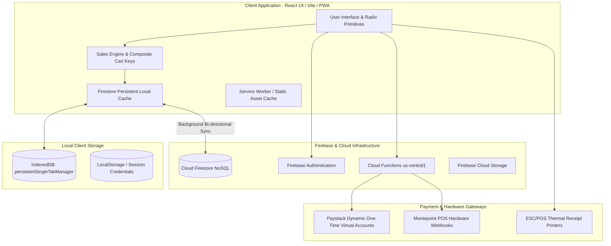

# NEXA Store OS (v2)

[](https://react.dev/)
[](https://vitejs.dev/)
[](https://tailwindcss.com/)
[](https://firebase.google.com/)
[](https://www.typescriptlang.org/)
[](https://vercel.com/)

**NEXA Store OS** is an enterprise-grade, offline-first Point of Sale (POS), multi-branch inventory management system, and retail operating system engineered for African retail stores, wholesale distributors, pharmacies, supermarkets, and restaurants.

---

## 📑 Table of Contents

1. [System Architecture](#-system-architecture)
2. [Core Feature Subsystems](#-core-feature-subsystems)
   - [Point of Sale & Multi-Tier Pricing](#1-point-of-sale--multi-tier-pricing)
   - [Catalog & Inventory Lifecycle](#2-catalog--inventory-lifecycle)
   - [Dynamic Virtual Accounts & Payments Engine](#3-dynamic-virtual-accounts--payments-engine)
   - [Customer CRM & Credit Ledger](#4-customer-crm--credit-ledger)
   - [Multi-Branch Warehouse Operations](#5-multi-branch-warehouse-operations)
   - [System Administrator Command Center](#6-system-administrator-command-center)
   - [Field Agent & Growth Suite](#7-field-agent--growth-suite)
3. [Technical Documentation](#-technical-documentation)
   - [Offline-First Data Architecture](#offline-first-data-architecture)
   - [Composite Cart Key & Dual-Pricing Logic](#composite-cart-key--dual-pricing-logic)
   - [Paystack Virtual Account & Fee Recovery Formula](#paystack-virtual-account--fee-recovery-formula)
   - [Role-Based Access Control & Security Protocols](#role-based-access-control--security-protocols)
   - [Firestore Collections & Schema Reference](#firestore-collections--schema-reference)
   - [Codebase & Directory Structure](#codebase--directory-structure)
4. [Environment Variables](#-environment-variables)
5. [Getting Started & Local Setup](#-getting-started--local-setup)
6. [Deployment Workflow](#-deployment-workflow)

---

## 🏗️ System Architecture



---

## 🚀 Core Feature Subsystems

### 1. Point of Sale & Multi-Tier Pricing
- **Zero-Latency Offline Checkout**: Cashiers can scan, ring up sales, calculate totals, and issue printed/digital receipts even when the store loses internet connectivity. Sales automatically write to local IndexedDB and reconcile with Cloud Firestore when connection resumes.
- **Wholesale & Retail Dual-Pricing**: Supports distinct retail and wholesale pricing tiers per product unit. Cashiers can switch modes globally or mix line-item price tiers on the fly.
- **Cashier Price Overrides with Admin Approval**: Store managers can configure whether price editing at checkout is locked or allowed. High-privilege price changes require root platform approval.
- **Multi-Modal Receipt Generation**:
  - Direct 58mm / 80mm ESC/POS raw bluetooth/USB thermal printing.
  - WhatsApp digital receipt dispatch directly to customer phone numbers.
  - High-resolution client-side PDF export with store branding, VAT breakdowns, and barcodes.

### 2. Catalog & Inventory Lifecycle
- **Hierarchical Unit Conversions**: Define products with primary units and conversion ratios (e.g., 1 Carton = 12 Packs = 144 Pieces). Stock is automatically decremented across all units accurately.
- **Batch Numbers & Expiration Tracking**: Dedicated tracking for pharmaceutical drug libraries, perishables, and lot-controlled inventory with expiry warning countdowns.
- **Shelf & Barcode Generator**: Built-in SVG/Canvas barcode generator producing printable shelf tags with product names, prices, and QR lookup codes.
- **CSV Import & Bulk Export**: Fast catalog ingestion with pre-import schema validation, missing field detection, and automated category matching.

### 3. Dynamic Virtual Accounts & Payments Engine
- **Dynamic One-Time Checkout NUBANs**: Replaces expensive dedicated virtual accounts with dynamic on-demand virtual account numbers generated via Paystack API at checkout.
- **Payer-Borne Fee Passing**: Automatically computes the exact fee recovery gross amount ($1.5\% + ₦100$, capped at $₦2,000$) so the store receives exactly 100% of their subscription or invoice total.
- **Moniepoint POS Hardware Integration**: Instant card terminal push payment listener and webhook reconciliation for physical counter card swipes.
- **Split Payments & Multi-Tender**: Supports mixed payments across Cash, POS Transfer, Card, and Store Credit in a single transaction.

### 4. Customer CRM & Credit Ledger
- **Debtors Ledger (Credit Book)**: Complete ledger of customer outstanding balances, credit limits, installment repayment schedules, and overdue penalties.
- **WhatsApp & SMS Debt Reminders**: One-click personalized debt reminder links with payment totals and store bank account details.
- **Customer Purchase Profiles**: Full purchase history, lifetime value (LTV), average basket size, and customer loyalty tiering.

### 5. Multi-Branch Warehouse Operations
- **Inter-Branch Stock Movement**: Create, dispatch, receive, and verify stock transfers between multiple warehouse locations and retail branches.
- **Movement Audit Ledger**: Immutable movement timeline capturing sender ID, receiver verification, timestamps, transfer reasons, and discrepancies.
- **Branch-Scoped Staff Access**: Restrict staff access strictly to their assigned branch location or enable global multi-branch oversight for senior managers.

### 6. System Administrator Command Center
- **Store Directory & Provisioning**: Instant deployment of new business tenants, subdomains, database namespaces, and default catalog templates.
- **Password-Authorized Subscription Desk**: Administrative actions (changing subscription dates, overriding feature limits, reactivating cancelled accounts, modifying tiers) require re-authentication with the administrator's password.
- **Dunning Management & Delinquency Outreach**: Log direct WhatsApp, phone, and email communications with past-due merchants.
- **Store Feature Flag Matrix**: Override individual store capabilities including Multi-Tier Pricing, Cross-Branch Visibility, and Maximum Branch Limits.

### 7. Field Agent & Growth Suite
- **Agent Network Onboarding**: Track boots-on-the-ground sales agents recruiting merchants across regional territories.
- **Automated Commission Calculations**: Real-time commission computation when onboarded stores pay subscription fees.
- **Instant Commission Payouts**: Automated Paystack Transfer recipient creation and payout disbursement.

---

## 💻 Technical Documentation

### Offline-First Data Architecture

NEXA Store OS utilizes Firestore's modern `persistentLocalCache` configured with `persistentSingleTabManager` to guarantee complete offline data persistence without multi-tab database lock contention:

```typescript
// src/lib/firebase.ts
import { initializeFirestore, persistentLocalCache, persistentSingleTabManager } from "firebase/firestore";

export const db = initializeFirestore(app, {
  localCache: persistentLocalCache({
    tabManager: persistentSingleTabManager({ forceOwnership: true }),
  }),
});
```

#### Why Single-Tab Manager?
Multi-tab IndexedDB locking across tabs in browsers frequently triggers assertion crashes (`firebase-js-sdk #9172`). Using `persistentSingleTabManager` with `forceOwnership: true` provides reliable, ultra-fast local reads and writes while preventing lock contention.

---

### Composite Cart Key & Dual-Pricing Logic

To support simultaneous retail and wholesale pricing for identical products within a single cart, the sales engine generates composite 3-part cart keys:

$$\text{CartKey} = \text{itemId} : \text{unitName} : \text{saleType}$$

```typescript
// src/components/sales/price-utils.ts
export function buildCartKey(itemId: string, unitName: string, saleType: "retail" | "wholesale"): string {
  return `${itemId}:${unitName}:${saleType}`;
}

export function parseCartKey(cartKey: string): { itemId: string; unitName: string; saleType: "retail" | "wholesale" } {
  const [itemId, unitName, saleType] = cartKey.split(":");
  return { itemId, unitName, saleType: saleType as "retail" | "wholesale" };
}
```

This prevents collisions when a cashier sells 2 pieces of an item at wholesale price and 1 piece at retail price in the same transaction.

---

### Paystack Virtual Account & Fee Recovery Formula

When generating one-time checkout virtual accounts, fees are dynamically transferred to the payer so that the merchant receives the exact invoice net amount ($N$):

$$\text{Gross Amount } (G) = \min\left( \frac{N + 100}{1 - 0.015}, N + 2000 \right)$$

*Where Paystack charges $1.5\% + ₦100$, capped at $₦2,000$ (with the $₦100$ fee waived on transactions below $₦2,500$).*

```typescript
// functions/src/utils/paystack-service.ts
export function calculateGrossAmount(netAmount: number): { grossAmount: number; fee: number } {
  const percentageFee = 0.015;
  const flatFee = netAmount >= 2500 ? 100 : 0;
  const feeCap = 2000;

  let calculatedFee = (netAmount * percentageFee) + flatFee;
  if (calculatedFee > feeCap) calculatedFee = feeCap;

  const grossAmount = Math.ceil(netAmount + calculatedFee);
  return { grossAmount, fee: calculatedFee };
}
```

---

### Role-Based Access Control & Security Protocols

```
┌─────────────────────────────────────────────────────────────┐
│                       system_admin                          │
│   (Root Platform Console, Subscriptions, Global Audits)     │
└──────────────────────────────┬──────────────────────────────┘
                               │
┌──────────────────────────────▼──────────────────────────────┐
│                          owner                              │
│  (Complete Store Governance, Staff Management, Financials)  │
└──────────────────────────────┬──────────────────────────────┘
                               │
┌──────────────────────────────▼──────────────────────────────┐
│                         manager                             │
│   (Catalog Management, Stock Movements, Customer Approvals) │
└──────────────────────────────┬──────────────────────────────┘
                               │
┌──────────────────────────────▼──────────────────────────────┐
│                     staff / cashier                         │
│            (Checkout POS, Basic Stock Lookups)              │
└─────────────────────────────────────────────────────────────┘
```

#### Re-Authentication Barrier
Critical actions (e.g., updating store subscription lifecycle, manual plan changes, user account wipes) require explicit password authorization via `EmailAuthProvider.credential(user.email, password)` and `reauthenticateWithCredential(user, credential)`.

---

### Firestore Collections & Schema Reference

| Collection Name | Document Key | Key Fields & Descriptions |
|---|---|---|
| `stores` | `storeId` | `name`, `slug`, `businessType`, `subscriptionTier`, `subscriptionStatus`, `currentPeriodEnd`, `features`, `createdAt` |
| `users` | `uid` | `email`, `displayName`, `role` (`system_admin` \| `owner` \| `manager` \| `staff`), `storeId`, `createdAt` |
| `staff` | `staffId` | `storeId`, `branchId`, `name`, `phone`, `role`, `permissions[]`, `active` |
| `products` | `productId` | `storeId`, `name`, `sku`, `category`, `units[]` (`name`, `price`, `wholesalePrice`, `conversionRate`), `stock`, `expiryDate` |
| `sales` | `saleId` | `storeId`, `branchId`, `cashierId`, `items[]` (`itemId`, `unitName`, `price`, `qty`, `salePriceMode`), `total`, `paymentMethod`, `createdAt` |
| `movements` | `movementId` | `storeId`, `type` (`transfer` \| `restock` \| `adjustment` \| `return`), `items[]`, `fromBranch`, `toBranch`, `status`, `actorId` |
| `subscriptionPlans` | `planId` | `name`, `price`, `billingCycle` (`monthly` \| `yearly`), `sortOrder`, `isActive`, `features` |
| `subscriptionEvents` | `eventId` | `storeId`, `eventType`, `fromPlan`, `toPlan`, `reason`, `actorId`, `timestamp` |
| `agents` | `agentId` | `name`, `email`, `phone`, `territory`, `status`, `earnings`, `bankDetails` |

---

### Codebase & Directory Structure

```
nexa-version2/
├── .env.example                     # Environment variables template
├── vercel.json                      # Vercel SPA routing & build configuration
├── vite.config.ts                   # Vite bundler, chunk splitting & alias configuration
├── functions/                       # Firebase Cloud Functions (TypeScript)
│   ├── src/
│   │   ├── index.ts                 # HTTPS endpoints, Paystack webhooks & cron tasks
│   │   └── utils/
│   │       ├── paystack-service.ts  # Paystack dynamic accounts & transfers
│   │       ├── moniepoint-service.ts# Moniepoint POS hardware integration
│   │       └── crypto.ts            # Security hashing & HMAC verification
│   └── package.json
└── src/
    ├── components/                  # Reusable UI component modules
    │   ├── catalog/                 # Product tables, QR generators, barcode dialogs
    │   ├── sales/                   # POS grid, composite cart, checkout dialogs
    │   ├── settings/                # Store preferences, payment dialogues, branch config
    │   ├── system-admin/            # System admin sidebar, live console, provisioning
    │   └── ui/                      # Shadcn UI primitives (Button, Dialog, Select, etc.)
    ├── contexts/                    # Global React Contexts
    │   ├── BusinessContext.tsx      # Active tenant store, branch selector, metadata
    │   └── FirebaseAuthContext.tsx  # User authentication & session management
    ├── hooks/                       # Custom React Query & operational hooks
    │   ├── useRole.ts               # RBAC permissions checker
    │   ├── useInventoryData.ts      # Real-time catalog & stock data
    │   └── useSalesData.ts          # Sales stream & revenue analytics
    ├── layouts/                     # Route layout wrappers
    │   ├── AppLayout.tsx            # Main merchant dashboard shell
    │   └── SystemAdminLayout.tsx    # Dark-mode root platform shell
    ├── lib/                         # Core utilities & SDK initializations
    │   ├── firebase.ts              # Firebase client & offline cache initialization
    │   ├── route-guard.ts           # Client-side permission routing engine
    │   └── utils.ts                 # Tailwind class merges & formatters
    └── routes/                      # Route view controllers (React Router 7)
        ├── app.dashboard.tsx        # Merchant business dashboard
        ├── app.sales.tsx            # Full-screen POS checkout view
        ├── app.catalog.tsx          # Inventory management workspace
        ├── system-admin.dashboard.tsx # Root platform command center
        └── system-admin.subscriptions.tsx # Password-authorized subscription desk
```

---

## ⚙️ Environment Variables

Copy the provided template to configure your local and production environments:

```bash
cp .env.example .env
```

### Frontend Configuration (Vercel & Local)

| Variable | Description | Required | Example |
|---|---|:---:|---|
| `VITE_FIREBASE_API_KEY` | Firebase Web API Key | **Yes** | `AIzaSy...` |
| `VITE_FIREBASE_AUTH_DOMAIN` | Firebase Auth domain | **Yes** | `project.firebaseapp.com` |
| `VITE_FIREBASE_PROJECT_ID` | Firebase Project ID | **Yes** | `project-id` |
| `VITE_FIREBASE_STORAGE_BUCKET` | Cloud Storage bucket URL | **Yes** | `project.firebasestorage.app` |
| `VITE_FIREBASE_MESSAGING_SENDER_ID` | Firebase Cloud Messaging Sender ID | **Yes** | `123456789012` |
| `VITE_FIREBASE_APP_ID` | Firebase Web App ID | **Yes** | `1:123456789012:web:abcdef` |
| `VITE_FIREBASE_MEASUREMENT_ID` | Google Analytics Measurement ID | No | `G-XXXXXXXXXX` |
| `VITE_USE_SUBDOMAINS` | Enable tenant subdomain routing (`*.domain.com`) | No | `false` |
| `VITE_STORE_DOMAIN` | Root domain for storefront vanity URLs | No | `nexastoreos.com` |
| `VITE_LANDING_URL` | Landing page URL for QR flyers & receipts | No | `https://nexastoreos.com` |

---

## 🚀 Getting Started & Local Setup

### Prerequisites
- **Node.js**: `v20.x` or higher
- **Package Manager**: `npm` or `pnpm`

### Local Setup
```bash
# 1. Clone the repository
git clone https://github.com/icedmist/nexa-version2.git
cd nexa-version2

# 2. Install dependencies
npm install

# 3. Setup environment variables
cp .env.example .env
# Open .env and add your Firebase credentials

# 4. Start local development server
npm run dev
```

The application will be accessible at `http://localhost:8080`.

---

## 🚢 Deployment Workflow

### Production Branch

> [!IMPORTANT]
> **`feature/system-admin-workflow` is the designated live production branch.**
> All pushes to this branch trigger automated zero-downtime deployments on Vercel.

```bash
# Deploy changes directly to production
git push origin feature/system-admin-workflow
```

### Vercel Deployment Settings
- **Framework Preset**: `Vite`
- **Build Command**: `npm run build`
- **Output Directory**: `dist`
- **SPA Rewrites**: Configured via [`vercel.json`](file:///home/snow/projects/nexa-version2/vercel.json)

---

## 📄 License & Attribution
Maintained by the **NEXA Engineering Team**.  
For administrative inquiries or technical support, contact: `talk2icedmist@gmail.com`.
